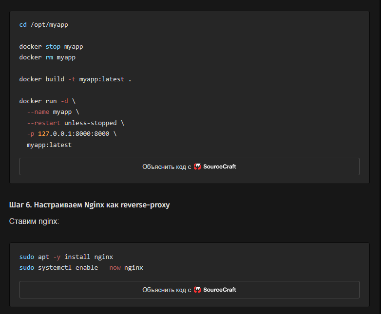
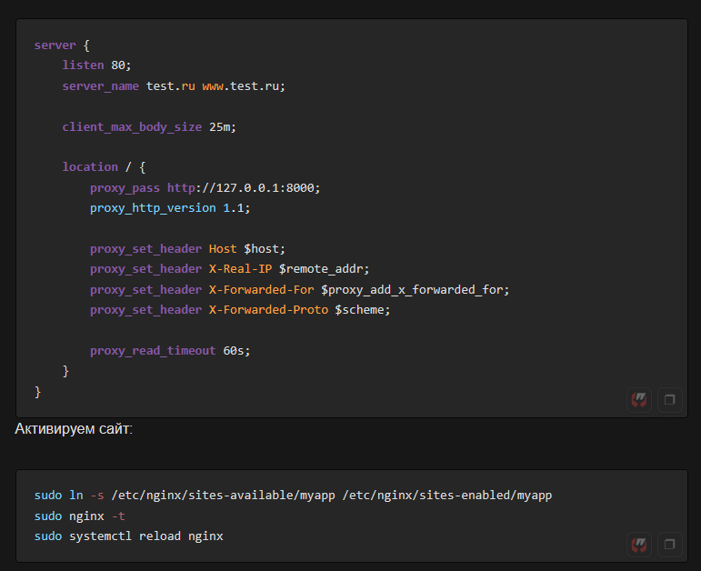
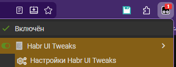
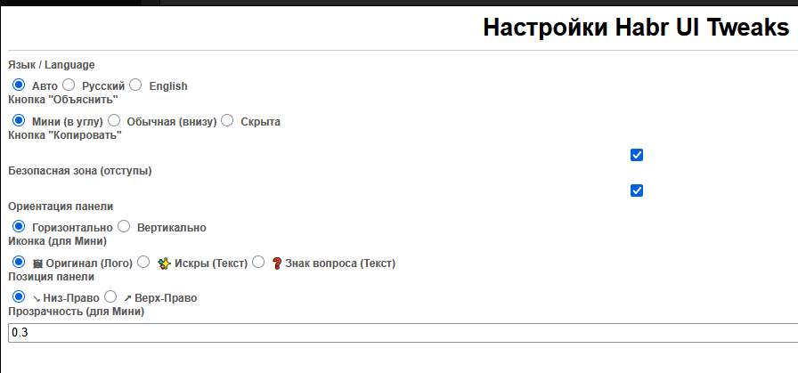

# Habr UI Tweaks
[Tampermonkey](https://www.tampermonkey.net/) скрипт модификации интерфейса https://habr.com на стороне клиента, с собственным окном настроек в Tampermonkey.

Иногда у пользователя есть свои представления о том, что и как он хочет видеть на сайте и как им пользоваться. Этот скрипт даёт настроить некоторые такие дополнительные возможности.

## Возможности скрипта
- Кнопка "Объяснить код" по умолчанию меньше и убрана в сторону. В настройках скрипта можно выключить её отображение полностью.
- Добавлена кнопка "Скопировать код". При желании, можно её выключить в настройках скрипта.
- Кнопке "Объяснить код" через настройки скрипта можно задать иной значок или же вернуть оригинальную версию "как было".

## Cсылки
[GreasyFork installable](https://greasyfork.org/scripts/562438-habr-ui-tweaks)

[GitHub repository](https://github.com/TheDerevtso/habr-ui-tweaks)

## Скриншоты:
### До

### После

### Настройки

### Вариант настроек
